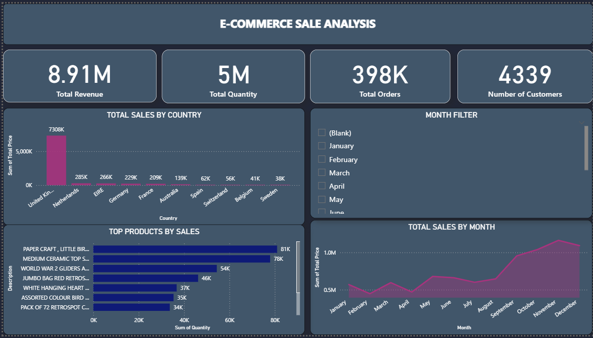
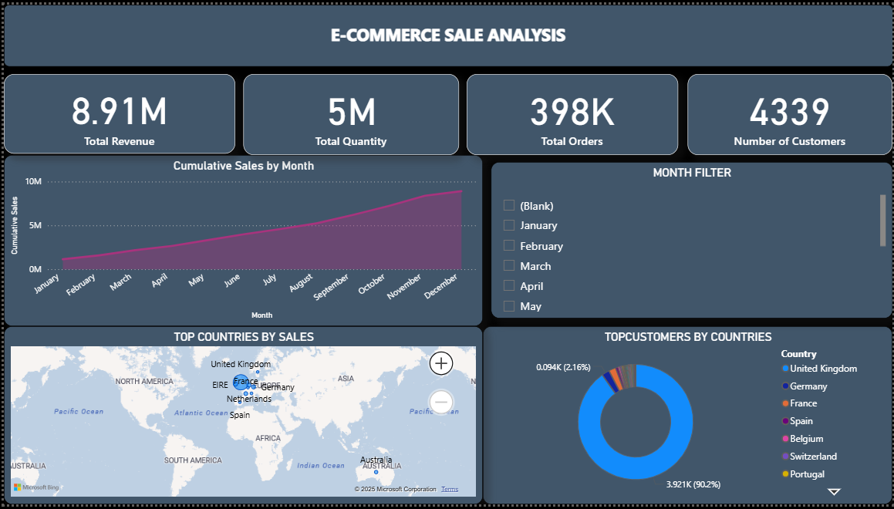

# 🛒 E-Commerce Sales Analysis

## 📌 Overview
This project analyzes an **E-Commerce sales dataset** using **Python (Jupyter Notebook)** for data cleaning and exploration, and **Power BI** for interactive dashboard visualizations.  
The goal is to identify trends, top-performing products, and customer behavior to support data-driven decision-making.

## 📂 Dataset
- **Source**: E-Commerce transactions dataset (cleaned and processed before visualization)
- **Key Columns**:
  - `InvoiceNo` - Unique identifier for each order
  - `StockCode` - Product code
  - `Description` - Product description
  - `Quantity` - Number of units sold
  - `InvoiceDate` - Date of purchase
  - `UnitPrice` - Price per unit
  - `Country` - Customer's country
  - `CustomerID` - Unique customer identifier

## 🛠 Steps Performed
### 1. Data Cleaning & Preprocessing (Jupyter Notebook)
- Removed null and duplicate values
- Converted date columns to proper datetime format
- Created calculated fields: `Total Price`, `Total Revenue`, `Total Orders`
- Aggregated data for analysis

### 2. Exploratory Data Analysis (EDA)
- Total sales by country
- Top-selling products
- Monthly sales trends
- Customer distribution

### 3. Power BI Dashboard
The final dashboard contains:
- **KPI Cards**:
  - Total Revenue
  - Total Quantity
  - Total Orders
  - Number of Customers
- **Visuals**:
  - Sales by Country (Bar chart)
  - Monthly Sales Trend (Line chart)
  - Top Products by Sales
  - Top Customers by Country (Pie chart)
  - Global Sales Map
  - Month Filter for interactivity

## 📊 Dashboard Screenshots
### Dashboard View 1



### Dashboard View 2


## 🔍 Key Insights
- **United Kingdom** dominates sales, contributing the largest share of revenue.
- A small set of products generates the majority of total sales.
- Sales peak during **November and December**, likely due to seasonal shopping trends.
- A few high-value customers contribute disproportionately to total revenue.

## ▶ How to Run
1. **Clone this repository**:
   ```bash
   git clone https://github.com/muhammadshammasp/E-Commerce-Sales-Analysis-Python-Power-BI-.git
   cd E-Commerce-Sales-Analysis-Python-Power-BI

2.JUpyter Notebook

pip install -r requirements.txt
jupyter notebook Ecommerce.ipynb


3.Open Power BI Dashboard

Open Ecommerce.pbix in Power BI Desktop
